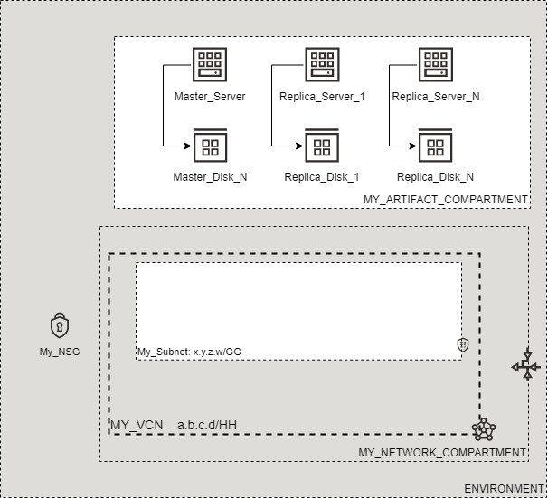

# OCI Cloud Bricks: Redis

[](https://img.shields.io/badge/license-UPL-green) [](https://sonarcloud.io/dashboard?id=oracle-devrel_terraform-oci-cloudbricks-redis)

## Introduction
The following brick contains the logic to provision a Redis database caluster in a highly available architecture. This is compromised of a master server and any number of replicas.

This brick is only supported on Oracle Linux for the time being.

## Reference Architecture
The following is the reference architecture associated to this brick



### Prerequisites
- Pre-baked Artifact and Network Compartments
- Pre-baked VCN

# Sample tfvar file

If using Fixes Shapes.

```shell
######################################## COMMON VARIABLES ######################################
region           = "re-region-1"
tenancy_ocid     = "ocid1.tenancy.oc1..aaaaaaaabcedfghijklmonoprstuvwxyz"
user_ocid        = "ocid1.user.oc1..aaaaaaaabcedfghijklmonoprstuvwxyz"
fingerprint      = "fo:oo:ba:ar:ba:ar"
private_key_path = "/absolute/path/to/api/key/your_api_key.pem"
######################################## COMMON VARIABLES ######################################
######################################## ARTIFACT SPECIFIC VARIABLES ######################################
ssh_public_key                          = "/absolute/path/to/api/key/your_ssh_public_key.pub"
ssh_private_key                         = "/absolute/path/to/api/key/your_ssh_private_key"
compute_nsg_name                        = "MY_NSG"
linux_compute_instance_compartment_name = "MY_ARTIFACT_COMPARTMENT"
linux_compute_network_compartment_name  = "MY_NETWORK_COMPARTMENT"
private_network_subnet_name             = "MY_PRIVATE_SUBNET"
vcn_display_name                        = "MY_VCN"

redis_master_name  = "MY_REDIS_MASTER_NAME"
redis_master_shape = "VM.Standard2.1"
redis_master_ad    = "aBCD:RE-REGION-1-AD-1"
redis_master_fd    = "FAULT-DOMAIN-1"

redis_replica_name    = "MY_REDIS_REPLICA_NAME"
redis_replica_count   = "3"
redis_replica_shape   = "VM.Standard2.1"
redis_replica_ad_list = ["oDQF:UK-LONDON-1-AD-1", "oDQF:UK-LONDON-1-AD-2", "oDQF:UK-LONDON-1-AD-3"]
redis_replica_fd_list = ["FAULT-DOMAIN-1", "FAULT-DOMAIN-2", "FAULT-DOMAIN-3"]

redis_version  = "6.2.5"

instance_backup_policy_level = "bronze"

master_disk_size_in_gb     = "50"
master_disk_vpus_per_gb    = "10"
master_backup_policy_level = "bronze"

replica_disk_size_in_gb     = "50"
replica_disk_vpus_per_gb    = "10"
replica_backup_policy_level = "bronze"
######################################## ARTIFACT SPECIFIC VARIABLES ######################################
```

If using Flex Shapes.

```shell
######################################## COMMON VARIABLES ######################################
region           = "re-region-1"
tenancy_ocid     = "ocid1.tenancy.oc1..aaaaaaaabcedfghijklmonoprstuvwxyz"
user_ocid        = "ocid1.user.oc1..aaaaaaaabcedfghijklmonoprstuvwxyz"
fingerprint      = "fo:oo:ba:ar:ba:ar"
private_key_path = "/absolute/path/to/api/key/your_api_key.pem"
######################################## COMMON VARIABLES ######################################
######################################## ARTIFACT SPECIFIC VARIABLES ######################################
ssh_public_key                          = "/absolute/path/to/api/key/your_ssh_public_key.pub"
ssh_private_key                         = "/absolute/path/to/api/key/your_ssh_private_key"
compute_nsg_name                        = "MY_NSG"
linux_compute_instance_compartment_name = "MY_ARTIFACT_COMPARTMENT"
linux_compute_network_compartment_name  = "MY_NETWORK_COMPARTMENT"
private_network_subnet_name             = "MY_PRIVATE_SUBNET"
vcn_display_name                        = "MY_VCN"

redis_master_name          = "MY_REDIS_MASTER_NAME"
redis_master_shape         = "VM.Standard.E4.Flex"
redis_master_ad            = "aBCD:RE-REGION-1-AD-1"
redis_master_fd            = "FAULT-DOMAIN-1"
redis_master_is_flex_shape = true
redis_master_ocpus         = "1"
redis_master_memory_in_gb  = "16"

redis_replica_name          = "MY_REDIS_REPLICA_NAME"
redis_replica_count         = "3"
redis_replica_shape         = "VM.Standard.E4.Flex"
redis_replica_ad_list       = ["oDQF:UK-LONDON-1-AD-1", "oDQF:UK-LONDON-1-AD-2", "oDQF:UK-LONDON-1-AD-3"]
redis_replica_fd_list       = ["FAULT-DOMAIN-1", "FAULT-DOMAIN-2", "FAULT-DOMAIN-3"]
redis_replica_is_flex_shape = true
redis_replica_memory_in_gb  = "1"
redis_replica_ocpus         = "16"

redis_version  = "6.2.5"

instance_backup_policy_level = "bronze"

master_disk_size_in_gb     = "50"
master_disk_vpus_per_gb    = "10"
master_backup_policy_level = "bronze"

replica_disk_size_in_gb     = "50"
replica_disk_vpus_per_gb    = "10"
replica_backup_policy_level = "bronze"
######################################## ARTIFACT SPECIFIC VARIABLES ######################################
```

### Variable Specific Conisderions
- Compute ssh keys to later log into instances. Paths to the keys should be provided in variables `ssh_public_key` and `ssh_private_key`.
- Variable `compute_nsg_name` is an optional network security group that can be attached.
- Variable `redis_version` may be set to any of the supported version of Redis at the time of creating this brick `(6.2.6, 6.0.16, 5.0.14)` Source: [Redis endoflife](https://endoflife.date/redis)
- Variable `redis_replica_count` determines how many replica instance are provisioned. This value has been tested between `1-30`, however a minimum of `3` is recommended.
- Variable `instance_backup_policy_level` specifies the name of the backup policy used on the instance boot volumes.
- Variables `master_backup_policy_level` and `replica_backup_policy_level` specificy the name of the backup policy used on the ISCSI disks storing data and log files on the master and replica servers respectively.
- Variables `master_disk_size_in_gb` and `replica_disk_size_in_gb` specify the size of the ISCSI disks in GB used to store data and log files on the master and replica servers respectively. This can be between `50` and `32768`.
- Variable `master_disk_vpus_per_gb` and `replica_disk_vpus_per_gb` specify the VPUs per GB of the ISCSI disks used to store data and log files on the master and replica servers respectively. The value must be between `0` and `120` and be multiple of 10.
- Flex Shapes:
  - Variable `redis_master_is_flex_shape` should be defined as true when the master instance is a flex shape. The variables `redis_master_ocpus` and `redis_master_memory_in_gb` should then also be defined. Do not use any of these variables at all when using a standard shape as they are not needed and assume sensible defaults.
  - Variable `redis_replica_is_flex_shape` should be defined as true when the replica instances are a flex shape. The variables `redis_replica_ocpus` and `redis_replica_memory_in_gb` should then also be defined. Do not use any of these variables at all when using a standard shape as they are not needed and assume sensible defaults.

### Sample provider
The following is the base provider definition to be used with this module

```shell
terraform {
  required_version = ">= 0.13.5"
}
provider "oci" {
  region       = var.region
  tenancy_ocid = var.tenancy_ocid
  user_ocid        = var.user_ocid
  fingerprint      = var.fingerprint
  private_key_path = var.private_key_path
  disable_auto_retries = "true"
}

provider "oci" {
  alias        = "home"
  region       = data.oci_identity_region_subscriptions.home_region_subscriptions.region_subscriptions[0].region_name
  tenancy_ocid = var.tenancy_ocid  
  user_ocid        = var.user_ocid
  fingerprint      = var.fingerprint
  private_key_path = var.private_key_path
  disable_auto_retries = "true"
}
```
## Variable documentation

## Requirements

| Name | Version |
|------|---------|
| <a name="requirement_terraform"></a> [terraform](#requirement\_terraform) | >= 0.13.5 |
| <a name="requirement_oci"></a> [oci](#requirement\_oci) | >= 4.36.0 |

## Providers

| Name | Version |
|------|---------|
| <a name="provider_null"></a> [null](#provider\_null) | 3.1.0 |
| <a name="provider_oci"></a> [oci](#provider\_oci) | 4.45.0 |
| <a name="provider_template"></a> [template](#provider\_template) | 2.2.0 |

## Modules

No modules.

## Resources

| Name | Type |
|------|------|
| [null_resource.format_disk_exec_redis_master](https://registry.terraform.io/providers/hashicorp/null/latest/docs/resources/resource) | resource |
| [null_resource.format_disk_exec_redis_replica](https://registry.terraform.io/providers/hashicorp/null/latest/docs/resources/resource) | resource |
| [null_resource.master_install_redis_binaries](https://registry.terraform.io/providers/hashicorp/null/latest/docs/resources/resource) | resource |
| [null_resource.mount_disk_exec_redis_master](https://registry.terraform.io/providers/hashicorp/null/latest/docs/resources/resource) | resource |
| [null_resource.mount_disk_exec_redis_replica](https://registry.terraform.io/providers/hashicorp/null/latest/docs/resources/resource) | resource |
| [null_resource.partition_disk_redis_master](https://registry.terraform.io/providers/hashicorp/null/latest/docs/resources/resource) | resource |
| [null_resource.partition_disk_redis_replica](https://registry.terraform.io/providers/hashicorp/null/latest/docs/resources/resource) | resource |
| [null_resource.provisioning_disk_redis_master](https://registry.terraform.io/providers/hashicorp/null/latest/docs/resources/resource) | resource |
| [null_resource.provisioning_disk_redis_replica](https://registry.terraform.io/providers/hashicorp/null/latest/docs/resources/resource) | resource |
| [null_resource.pvcreate_exec_redis_master](https://registry.terraform.io/providers/hashicorp/null/latest/docs/resources/resource) | resource |
| [null_resource.pvcreate_exec_redis_replica](https://registry.terraform.io/providers/hashicorp/null/latest/docs/resources/resource) | resource |
| [null_resource.redis_setup_master](https://registry.terraform.io/providers/hashicorp/null/latest/docs/resources/resource) | resource |
| [null_resource.redis_setup_replicas](https://registry.terraform.io/providers/hashicorp/null/latest/docs/resources/resource) | resource |
| [null_resource.replica_install_redis_binaries](https://registry.terraform.io/providers/hashicorp/null/latest/docs/resources/resource) | resource |
| [null_resource.sentinel_setup_master](https://registry.terraform.io/providers/hashicorp/null/latest/docs/resources/resource) | resource |
| [null_resource.sentinel_setup_replicas](https://registry.terraform.io/providers/hashicorp/null/latest/docs/resources/resource) | resource |
| [null_resource.vgcreate_exec_redis_master](https://registry.terraform.io/providers/hashicorp/null/latest/docs/resources/resource) | resource |
| [null_resource.vgcreate_exec_redis_replica](https://registry.terraform.io/providers/hashicorp/null/latest/docs/resources/resource) | resource |
| [oci_core_instance.redis_master](https://registry.terraform.io/providers/hashicorp/oci/latest/docs/resources/core_instance) | resource |
| [oci_core_instance.redis_replica](https://registry.terraform.io/providers/hashicorp/oci/latest/docs/resources/core_instance) | resource |
| [oci_core_volume.ISCSIDisk_redis_master](https://registry.terraform.io/providers/hashicorp/oci/latest/docs/resources/core_volume) | resource |
| [oci_core_volume.ISCSIDisk_redis_replica](https://registry.terraform.io/providers/hashicorp/oci/latest/docs/resources/core_volume) | resource |
| [oci_core_volume_attachment.ISCSIDiskAttachment_redis_master](https://registry.terraform.io/providers/hashicorp/oci/latest/docs/resources/core_volume_attachment) | resource |
| [oci_core_volume_attachment.ISCSIDiskAttachment_redis_replica](https://registry.terraform.io/providers/hashicorp/oci/latest/docs/resources/core_volume_attachment) | resource |
| [oci_core_volume_backup_policy_assignment.backup_policy_assignment_ISCSI_Disk_redis_master](https://registry.terraform.io/providers/hashicorp/oci/latest/docs/resources/core_volume_backup_policy_assignment) | resource |
| [oci_core_volume_backup_policy_assignment.backup_policy_assignment_ISCSI_Disk_redis_replica](https://registry.terraform.io/providers/hashicorp/oci/latest/docs/resources/core_volume_backup_policy_assignment) | resource |
| [oci_core_volume_backup_policy_assignment.backup_policy_assignment_redis_master](https://registry.terraform.io/providers/hashicorp/oci/latest/docs/resources/core_volume_backup_policy_assignment) | resource |
| [oci_core_volume_backup_policy_assignment.backup_policy_assignment_redis_replica](https://registry.terraform.io/providers/hashicorp/oci/latest/docs/resources/core_volume_backup_policy_assignment) | resource |
| [oci_core_images.ORACLELINUX](https://registry.terraform.io/providers/hashicorp/oci/latest/docs/data-sources/core_images) | data source |
| [oci_core_network_security_groups.NSG](https://registry.terraform.io/providers/hashicorp/oci/latest/docs/data-sources/core_network_security_groups) | data source |
| [oci_core_subnets.PRIVATESUBNET](https://registry.terraform.io/providers/hashicorp/oci/latest/docs/data-sources/core_subnets) | data source |
| [oci_core_vcns.VCN](https://registry.terraform.io/providers/hashicorp/oci/latest/docs/data-sources/core_vcns) | data source |
| [oci_core_volume_backup_policies.INSTANCEBACKUPPOLICY](https://registry.terraform.io/providers/hashicorp/oci/latest/docs/data-sources/core_volume_backup_policies) | data source |
| [oci_core_volume_backup_policies.MASTERBACKUPPOLICY](https://registry.terraform.io/providers/hashicorp/oci/latest/docs/data-sources/core_volume_backup_policies) | data source |
| [oci_core_volume_backup_policies.REPLICABACKUPPOLICY](https://registry.terraform.io/providers/hashicorp/oci/latest/docs/data-sources/core_volume_backup_policies) | data source |
| [oci_identity_compartments.COMPARTMENTS](https://registry.terraform.io/providers/hashicorp/oci/latest/docs/data-sources/identity_compartments) | data source |
| [oci_identity_compartments.NWCOMPARTMENTS](https://registry.terraform.io/providers/hashicorp/oci/latest/docs/data-sources/identity_compartments) | data source |
| [template_file.install_redis_binaries_sh](https://registry.terraform.io/providers/hashicorp/template/latest/docs/data-sources/file) | data source |
| [template_file.redis_setup_master_sh](https://registry.terraform.io/providers/hashicorp/template/latest/docs/data-sources/file) | data source |
| [template_file.redis_setup_replicas_sh](https://registry.terraform.io/providers/hashicorp/template/latest/docs/data-sources/file) | data source |

## Inputs

| Name | Description | Type | Default | Required |
|------|-------------|------|---------|:--------:|
| <a name="input_compute_nsg_name"></a> [compute\_nsg\_name](#input\_compute\_nsg\_name) | Name of the NSG associated to the computes | `string` | `""` | no |
| <a name="input_fingerprint"></a> [fingerprint](#input\_fingerprint) | API Key Fingerprint for user\_ocid derived from public API Key imported in OCI User config | `any` | n/a | yes |
| <a name="input_instance_backup_policy_level"></a> [instance\_backup\_policy\_level](#input\_instance\_backup\_policy\_level) | The backup policy of all instances boot volumes | `any` | n/a | yes |
| <a name="input_linux_compute_instance_compartment_name"></a> [linux\_compute\_instance\_compartment\_name](#input\_linux\_compute\_instance\_compartment\_name) | Defines the compartment name where the infrastructure will be created | `any` | n/a | yes |
| <a name="input_linux_compute_network_compartment_name"></a> [linux\_compute\_network\_compartment\_name](#input\_linux\_compute\_network\_compartment\_name) | Defines the compartment where the Network is currently located | `any` | n/a | yes |
| <a name="input_master_backup_policy_level"></a> [master\_backup\_policy\_level](#input\_master\_backup\_policy\_level) | The backup policy of the master instance ISCSI disk | `any` | n/a | yes |
| <a name="input_master_disk_size_in_gb"></a> [master\_disk\_size\_in\_gb](#input\_master\_disk\_size\_in\_gb) | The size of the attached disk to the master instance, stores database and log data | `any` | n/a | yes |
| <a name="input_master_disk_vpus_per_gb"></a> [master\_disk\_vpus\_per\_gb](#input\_master\_disk\_vpus\_per\_gb) | The VPUS of the attached disk to the master instance | `any` | n/a | yes |
| <a name="input_private_key_path"></a> [private\_key\_path](#input\_private\_key\_path) | Private Key Absolute path location where terraform is executed | `any` | n/a | yes |
| <a name="input_private_network_subnet_name"></a> [private\_network\_subnet\_name](#input\_private\_network\_subnet\_name) | Defines the subnet display name where this resource will be created at | `any` | n/a | yes |
| <a name="input_redis_master_ad"></a> [redis\_master\_ad](#input\_redis\_master\_ad) | The availability domain to provision the master instance in | `any` | n/a | yes |
| <a name="input_redis_master_fd"></a> [redis\_master\_fd](#input\_redis\_master\_fd) | The fault domain to provision the master instance in | `any` | n/a | yes |
| <a name="input_redis_master_is_flex_shape"></a> [redis\_master\_is\_flex\_shape](#input\_redis\_master\_is\_flex\_shape) | Boolean to determine if the master instance is flex or not | `bool` | `false` | no |
| <a name="input_redis_master_memory_in_gb"></a> [redis\_master\_memory\_in\_gb](#input\_redis\_master\_memory\_in\_gb) | The amount of memory in GB for the master instance to use when flex shape is enabled | `string` | `""` | no |
| <a name="input_redis_master_name"></a> [redis\_master\_name](#input\_redis\_master\_name) | The name given to the master instance | `any` | n/a | yes |
| <a name="input_redis_master_ocpus"></a> [redis\_master\_ocpus](#input\_redis\_master\_ocpus) | The number of OCPUS for the master instance to use when flex shape is enabled | `string` | `""` | no |
| <a name="input_redis_master_shape"></a> [redis\_master\_shape](#input\_redis\_master\_shape) | The shape for the master instance to use | `any` | n/a | yes |
| <a name="input_redis_replica_ad_list"></a> [redis\_replica\_ad\_list](#input\_redis\_replica\_ad\_list) | The availability domains to provision the replica instances in | `any` | n/a | yes |
| <a name="input_redis_replica_count"></a> [redis\_replica\_count](#input\_redis\_replica\_count) | The number of replica instances to provision | `number` | n/a | yes |
| <a name="input_redis_replica_fd_list"></a> [redis\_replica\_fd\_list](#input\_redis\_replica\_fd\_list) | The fault domains to provision the replica instances in | `any` | n/a | yes |
| <a name="input_redis_replica_is_flex_shape"></a> [redis\_replica\_is\_flex\_shape](#input\_redis\_replica\_is\_flex\_shape) | Boolean to determine if the replica instances are flex or not | `bool` | `false` | no |
| <a name="input_redis_replica_memory_in_gb"></a> [redis\_replica\_memory\_in\_gb](#input\_redis\_replica\_memory\_in\_gb) | The amount of memory in GB for the replica instances to use when flex shape is enabled | `string` | `""` | no |
| <a name="input_redis_replica_name"></a> [redis\_replica\_name](#input\_redis\_replica\_name) | The name given to the replica instances | `any` | n/a | yes |
| <a name="input_redis_replica_ocpus"></a> [redis\_replica\_ocpus](#input\_redis\_replica\_ocpus) | The number of OCPUS for the replica instances to use when flex shape is enabled | `string` | `""` | no |
| <a name="input_redis_replica_shape"></a> [redis\_replica\_shape](#input\_redis\_replica\_shape) | The shape for the replica instances to use | `any` | n/a | yes |
| <a name="input_redis_version"></a> [redis\_version](#input\_redis\_version) | The version of Redis used in the setup | `any` | n/a | yes |
| <a name="input_region"></a> [region](#input\_region) | Target region where artifacts are going to be created | `any` | n/a | yes |
| <a name="input_replica_backup_policy_level"></a> [replica\_backup\_policy\_level](#input\_replica\_backup\_policy\_level) | The backup policy of replica instances ISCSI disks | `any` | n/a | yes |
| <a name="input_replica_disk_size_in_gb"></a> [replica\_disk\_size\_in\_gb](#input\_replica\_disk\_size\_in\_gb) | The size of the attached disk to the replica instances, stores database and log data | `any` | n/a | yes |
| <a name="input_replica_disk_vpus_per_gb"></a> [replica\_disk\_vpus\_per\_gb](#input\_replica\_disk\_vpus\_per\_gb) | The VPUS of the attached disk to the replica instances | `any` | n/a | yes |
| <a name="input_ssh_private_key"></a> [ssh\_private\_key](#input\_ssh\_private\_key) | Defines SSH Private Key to be used in order to remotely connect to compute instances | `any` | n/a | yes |
| <a name="input_ssh_public_key"></a> [ssh\_public\_key](#input\_ssh\_public\_key) | Defines SSH Public Key to be used in order to remotely connect to compute instances | `any` | n/a | yes |
| <a name="input_tenancy_ocid"></a> [tenancy\_ocid](#input\_tenancy\_ocid) | OCID of tenancy | `any` | n/a | yes |
| <a name="input_user_ocid"></a> [user\_ocid](#input\_user\_ocid) | User OCID in tenancy. Currently hardcoded to user denny.alquinta@oracle.com | `any` | n/a | yes |
| <a name="input_vcn_display_name"></a> [vcn\_display\_name](#input\_vcn\_display\_name) | VCN Display name to execute lookup | `any` | n/a | yes |

## Outputs

| Name | Description |
|------|-------------|
| <a name="output_redis_master_server"></a> [redis\_master\_server](#output\_redis\_master\_server) | Redis Master Instance |
| <a name="output_redis_replica_servers"></a> [redis\_replica\_servers](#output\_redis\_replica\_servers) | Redis Replica Instances |

## Contributing
This project is open source.  Please submit your contributions by forking this repository and submitting a pull request!  Oracle appreciates any contributions that are made by the open source community.

## License
Copyright (c) 2024 Oracle and/or its affiliates.

Licensed under the Universal Permissive License (UPL), Version 1.0.

See [LICENSE](LICENSE.txt) for more details.
